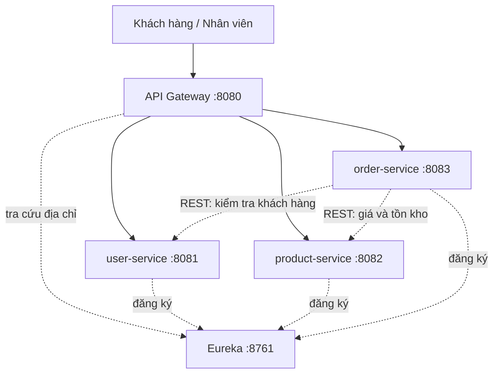

# BookMart — MSS301 E-commerce

Hệ thống bán sách trực tuyến theo kiến trúc microservices, dùng Spring Boot và Spring Cloud. Giai đoạn sau sẽ đóng gói bằng Docker và Docker Compose.

## Mục tiêu project

Xây một hệ thống gồm Service Discovery, API Gateway và ba microservices, chạy độc lập rồi giao tiếp qua REST. Bài toán cụ thể là **BookMart**: khách hàng có tài khoản, cửa hàng quản lý sách, khách đặt và theo dõi đơn hàng.

Giai đoạn 1 hoàn thành phần phân tích, sơ đồ kiến trúc và skeleton project. Chưa có đủ API nghiệp vụ và chưa có Docker.

## Thành viên nhóm

| Thành viên | MSSV | Vai trò |
| --- | --- | --- |
| Hồ Huy Thành | HE187135 | Nhóm trưởng, phụ trách nền tảng: Discovery Server, API Gateway, `user-service`, sơ đồ kiến trúc và README. |
| Bạch Văn Đức | HE181874 | Phụ trách nghiệp vụ bán hàng: phân tích bài toán, so sánh kiến trúc, `product-service`, `order-service`. |

Chi tiết phân công nằm ở [docs/phan-cong-nhom.docx](docs/phan-cong-nhom.docx).

## Kiến trúc tổng quát

Client chỉ đi qua API Gateway. Gateway chuyển request tới đúng service. Eureka là Service Discovery: các service đăng ký địa chỉ tại đây để Gateway và các service tìm nhau. `order-service` gọi `user-service` và `product-service` bằng REST khi tạo đơn.

| Thành phần | Thư mục | Cổng |
| --- | --- | --- |
| Service Discovery (Eureka) | `/discovery-server` | 8761 |
| API Gateway | `/api-gateway` | 8080 |
| user-service | `/services/user-service` | 8081 |
| product-service | `/services/product-service` | 8082 |
| order-service | `/services/order-service` | 8083 |



Sơ đồ đầy đủ và giải thích luồng request: [docs/architecture-diagram.html](docs/architecture-diagram.html), [docs/so-do-kien-truc.docx](docs/so-do-kien-truc.docx).

## Tài liệu giai đoạn 1

- [Phân tích bài toán](docs/phan-tich-bai-toan.docx)
- [So sánh Monolithic và Microservices](docs/so-sanh-monolithic-va-microservices.docx)
- [Sơ đồ kiến trúc](docs/so-do-kien-truc.docx)
- [Phân công nhóm](docs/phan-cong-nhom.docx)

## Cấu trúc thư mục

```text
/docs
/discovery-server
/api-gateway
/services
  /user-service
  /product-service
  /order-service
README.md
```

Mỗi thư mục là một project Spring Boot riêng, build bằng Maven, Java 21. Skeleton giai đoạn 1 chỉ khởi động được và trả về thông tin nhận diện service. Chưa có controller nghiệp vụ, repository hay cơ sở dữ liệu.
