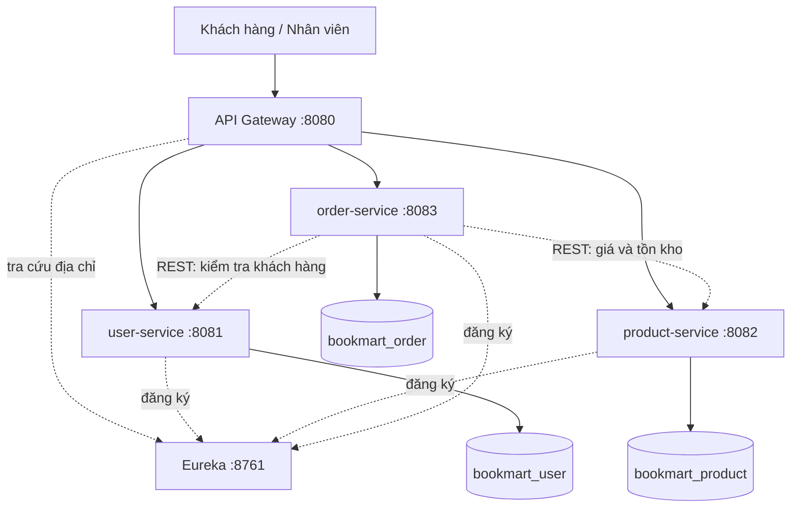

# BookMart — MSS301 E-commerce

Hệ thống bán sách trực tuyến theo kiến trúc microservices, dùng Spring Boot, Spring Cloud, Docker và Docker Compose.

## Mục tiêu project

Xây một hệ thống gồm Service Discovery, API Gateway và ba microservices, chạy độc lập rồi giao tiếp qua REST. Bài toán cụ thể là **BookMart**: khách hàng có tài khoản, cửa hàng quản lý sách, khách đặt và theo dõi đơn hàng.

Hệ thống có API REST cho ba service, Eureka, Gateway định tuyến, `order-service` gọi hai service kia khi tạo hoặc hủy đơn, và chạy được bằng `docker-compose up`.

## Thành viên nhóm

| Thành viên | MSSV | Vai trò |
| --- | --- | --- |
| Hồ Huy Thành | HE187135 | Nhóm trưởng, phụ trách nền tảng: Discovery Server, API Gateway, `user-service`, sơ đồ kiến trúc và README. |
| Bạch Văn Đức | HE181874 | Phụ trách nghiệp vụ bán hàng: phân tích bài toán, so sánh kiến trúc, `product-service`, `order-service`. |

Chi tiết phân công nằm ở [docs/phan-cong-nhom.docx](docs/phan-cong-nhom.docx).

## Kiến trúc tổng quát

Client chỉ đi qua API Gateway. Gateway chuyển request tới đúng service. Eureka là Service Discovery: các service đăng ký địa chỉ tại đây để Gateway và các service tìm nhau. `order-service` gọi `user-service` và `product-service` bằng REST khi tạo đơn. Mỗi service ghi dữ liệu vào database MySQL riêng.

| Thành phần | Thư mục | Cổng |
| --- | --- | --- |
| Service Discovery (Eureka) | `/discovery-server` | 8761 |
| API Gateway | `/api-gateway` | 8080 |
| user-service | `/services/user-service` | 8081 |
| product-service | `/services/product-service` | 8082 |
| order-service | `/services/order-service` | 8083 |
| MySQL | `/mysql` | 3306 |


```mermaid
flowchart TB
    client[Khách hàng / Nhân viên] --> gateway[API Gateway :8080]
    gateway --> userSvc[user-service :8081]
    gateway --> productSvc[product-service :8082]
    gateway --> orderSvc[order-service :8083]
    gateway -. tra cứu địa chỉ .-> eureka[Eureka :8761]
    userSvc -. đăng ký .-> eureka
    productSvc -. đăng ký .-> eureka
    orderSvc -. đăng ký .-> eureka
    orderSvc -. REST: kiểm tra khách hàng .-> userSvc
    orderSvc -. REST: giá và tồn kho .-> productSvc
    userSvc --> userDb[(bookmart_user)]
    productSvc --> productDb[(bookmart_product)]
    orderSvc --> orderDb[(bookmart_order)]
```

Sơ đồ đầy đủ: [docs/architecture-diagram.html](docs/architecture-diagram.html), [docs/so-do-kien-truc.docx](docs/so-do-kien-truc.docx). Luồng request: [docs/luong-request.md](docs/luong-request.md). Docker: [docs/huong-dan-docker.md](docs/huong-dan-docker.md).

## Tài liệu

- [Phân tích bài toán](docs/phan-tich-bai-toan.docx)
- [So sánh Monolithic và Microservices](docs/so-sanh-monolithic-va-microservices.docx)
- [Sơ đồ kiến trúc](docs/so-do-kien-truc.docx)
- [Phân công nhóm](docs/phan-cong-nhom.docx)
- [Luồng request](docs/luong-request.md)
- [Hướng dẫn build và chạy Docker](docs/huong-dan-docker.md)

## Cấu trúc thư mục

```text
/docs
/discovery-server
  Dockerfile
/api-gateway
  Dockerfile
/services
  /user-service/Dockerfile
  /product-service/Dockerfile
  /order-service/Dockerfile
/mysql
docker-compose.yml
README.md
```

Mỗi thư mục service là một project Spring Boot riêng, build bằng Maven, Java 21. Ba service có controller, service, repository và một database MySQL riêng.

## Cơ sở dữ liệu

MySQL 8, cổng 3306. Mỗi service một database, không dùng chung bảng.

| Service | Database |
| --- | --- |
| user-service | `bookmart_user` |
| product-service | `bookmart_product` |
| order-service | `bookmart_order` |

User: `bookmart`, mật khẩu `BookMart@2026`. Hibernate tự tạo bảng khi service khởi động (`ddl-auto=update`). Bộ mã `utf8mb4` để giữ tiếng Việt.

Khi chạy Docker, Compose tạo sẵn ba database từ `mysql/init.sql`. Khi chạy local, có thể bật mỗi MySQL: `docker-compose up mysql -d`.

## Chạy hệ thống bằng docker-compose

Cần Docker Desktop. Đứng tại thư mục `MSS301_Project_E-comerce`:

```text
docker-compose up --build
```

Một lệnh này build image, tạo network, chạy MySQL, Eureka, ba microservices và API Gateway. Lần đầu mất vài phút vì Maven tải dependency trong Dockerfile.

Eureka: http://localhost:8761  
Client gọi qua Gateway: http://localhost:8080  
Swagger UI (gọi API qua Gateway, không cần Postman): http://localhost:8080/swagger-ui.html  

Trong Swagger chọn `user-service` / `product-service` / `order-service` ở dropdown, bấm **Try it out**.

Dữ liệu mẫu sau khi khởi động:

| Dữ liệu | Giá trị |
| --- | --- |
| Khách hàng | id 1, email `an@bookmart.local` |
| Nhân viên | id 2, email `ha.staff@bookmart.local` |
| Sách | id 1, 2, 3 |

Tạo đơn qua Gateway:

```text
curl.exe -X POST http://localhost:8080/api/orders -H "Content-Type: application/json" -d "{\"userId\":1,\"items\":[{\"productId\":1,\"quantity\":1}]}"
```

Xem sách, xem đơn của khách, rồi xác nhận đơn:

```text
curl.exe http://localhost:8080/api/products
curl.exe "http://localhost:8080/api/orders?userId=1"
curl.exe -X PATCH http://localhost:8080/api/orders/1/status -H "Content-Type: application/json" -d "{\"status\":\"CONFIRMED\"}"
```

Chi tiết build, log, dừng container: [docs/huong-dan-docker.md](docs/huong-dan-docker.md).

## Hướng dẫn chạy local (không Docker hóa app)

Cần Java 21 và MySQL (hoặc `docker-compose up mysql -d`). Mở năm terminal, đứng tại `MSS301_Project_E-comerce`, chạy Eureka trước:

```text
.\mvnw.cmd -f discovery-server\pom.xml spring-boot:run
.\mvnw.cmd -f services\user-service\pom.xml spring-boot:run
.\mvnw.cmd -f services\product-service\pom.xml spring-boot:run
.\mvnw.cmd -f services\order-service\pom.xml spring-boot:run
.\mvnw.cmd -f api-gateway\pom.xml spring-boot:run
```

Đợi các service hiện trên Eureka: http://localhost:8761

Khi tạo đơn, tồn kho giảm. Hủy đơn (`CANCELLED`) thì tồn kho được cộng lại. Chi tiết từng bước nằm ở [docs/luong-request.md](docs/luong-request.md).
