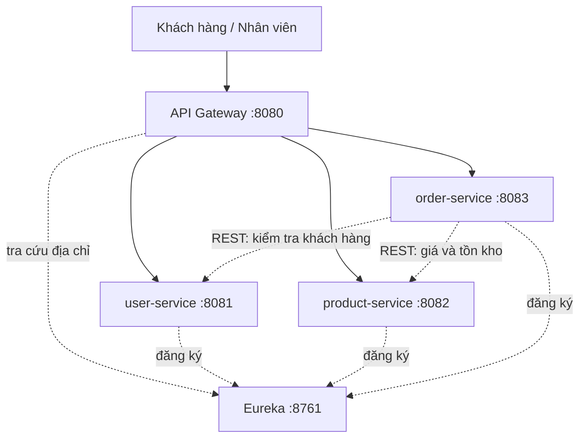

# BookMart — MSS301 E-commerce

Hệ thống bán sách trực tuyến theo kiến trúc microservices, xây bằng Spring Boot và Spring Cloud. Mã nguồn nằm trong thư mục `MSS301_Project_E-comerce`.

## Mục tiêu project

Xây dựng **BookMart**, cửa hàng sách trực tuyến, gồm Service Discovery, API Gateway và ba microservices giao tiếp qua REST. Mỗi service sở hữu dữ liệu riêng, không dùng chung cơ sở dữ liệu.

Ba miền nghiệp vụ:

- **Người dùng** (`user-service`): tài khoản và hồ sơ khách hàng.
- **Sản phẩm** (`product-service`): danh mục sách, giá và tồn kho.
- **Đơn hàng** (`order-service`): tạo đơn và theo dõi trạng thái đơn.

Khách hàng đăng ký tài khoản, xem sách và đặt mua. Nhân viên quản lý sách, giá, tồn kho và trạng thái đơn. Thanh toán trực tuyến, vận chuyển, đánh giá sách và khuyến mãi nằm ngoài phạm vi.

Giai đoạn hiện tại hoàn thành phân tích bài toán, sơ đồ kiến trúc và skeleton project. API nghiệp vụ, đăng ký Eureka, định tuyến Gateway và Docker làm ở các giai đoạn sau.

## Thành viên nhóm

| Thành viên | MSSV | Vai trò |
| --- | --- | --- |
| Hồ Huy Thành | HE187135 | Nhóm trưởng, phụ trách nền tảng: Discovery Server, API Gateway, `user-service`, sơ đồ kiến trúc và README. |
| Bạch Văn Đức | HE181874 | Phụ trách nghiệp vụ bán hàng: phân tích bài toán, so sánh kiến trúc, `product-service`, `order-service`. |

Chi tiết phân công: [MSS301_Project_E-comerce/docs/phan-cong-nhom.docx](MSS301_Project_E-comerce/docs/phan-cong-nhom.docx).

## Kiến trúc tổng quát

Client chỉ gửi request tới API Gateway. Gateway chuyển tiếp tới đúng microservice. Eureka là Service Discovery: các service đăng ký địa chỉ khi khởi động để Gateway và các service tìm nhau. Khi tạo đơn, `order-service` gọi `user-service` để xác nhận khách hàng, rồi gọi `product-service` để lấy giá và kiểm tra tồn kho.

| Thành phần | Thư mục | Cổng | Vai trò |
| --- | --- | --- | --- |
| API Gateway | `MSS301_Project_E-comerce/api-gateway` | 8080 | Cửa vào duy nhất |
| Service Discovery (Eureka) | `MSS301_Project_E-comerce/discovery-server` | 8761 | Đăng ký và tra cứu địa chỉ service |
| user-service | `MSS301_Project_E-comerce/services/user-service` | 8081 | Tài khoản và hồ sơ |
| product-service | `MSS301_Project_E-comerce/services/product-service` | 8082 | Sách, giá và tồn kho |
| order-service | `MSS301_Project_E-comerce/services/order-service` | 8083 | Đơn hàng và trạng thái đơn |

Sơ đồ và giải thích luồng request: [MSS301_Project_E-comerce/docs/architecture-diagram.html](MSS301_Project_E-comerce/docs/architecture-diagram.html), [MSS301_Project_E-comerce/docs/so-do-kien-truc.docx](MSS301_Project_E-comerce/docs/so-do-kien-truc.docx).
